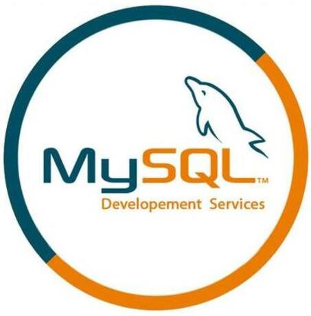
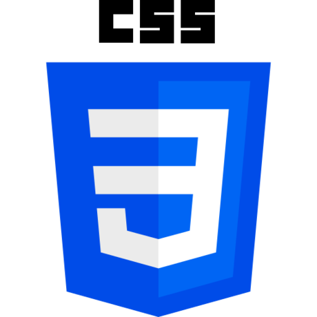
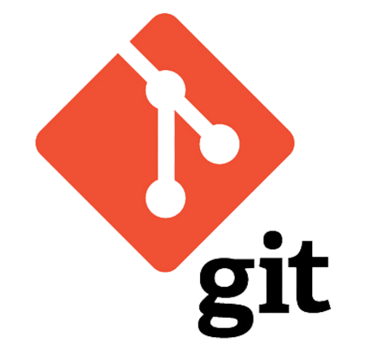
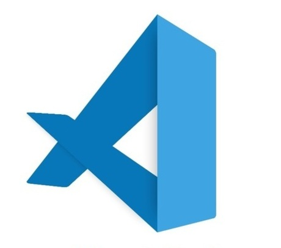

## Portfolio QA Engineer

## Hi, I'm Natasha, a QA specialist!

Here I want to share my portfolio in web and mobile testing, compiled on educational projects.

## Quick Facts:
- Specializes in manual testing of web and mobile applications
- Mentor of Sandbox_Web on commercial practice in manual testing from [QA Course](https://www.linkedin.com/company/qa-course-by-vadim-ksendzov/posts/) Vadim Ksendzov
- Doing a commercial internship at [ITX](https://www.linkedin.com/company/itxqa/) 
(Testing the site [capital.com](https://capital.com/en-au) (Prod version))
- I have a resume 
<!-- [Resume] (ссылка) -->

## How to Contact Me:

    
    
    

## Languages and Tools
<!-- 

 -->

<!-- 

[Jira](Tools/jira-original-wordmark.svg)

 -->

<!--  -->

## Test Artifacts
The links below contain test artifacts related to topics studied in educational projects.

- Checklists 
<!-- [Check-lists] (ссылка на сайт) -->
- Test cases
<!-- [Test cases] (ссылка на сайт) -->
- Bug reports
<!-- [Bug reports] (ссылка на сайт) -->
- Postman Collections
<!-- [Postman Collections] (ссылка на сайт) -->
- Database Queries
<!-- [Database Queries] (ссылка на сайт) -->

<!-- Testing Documentation (чек-листы, тест-кейсы, баг-репорты)
Web Application Testing
Mobile Application Testing
Postman Collections for API Testing
Database Queries -->

## Courses
- GeekBrains | QA Engineer  
December 2022 - March 2024  

- Stepik | Author of the course - Artsiom Rusau QA  
Software testing from scratch. Theory + Practice   
November 2024  

