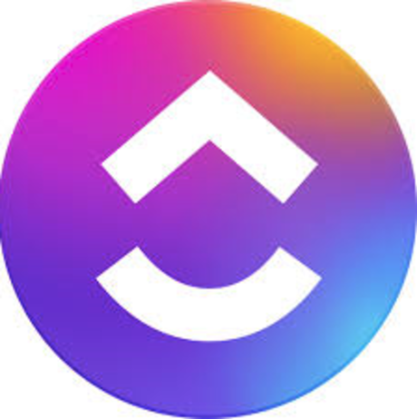

# Portfolio QA Engineer

## Hi, I'm Natasha, a QA specialist!

This repository showcases my portfolio of test artifacts from educational projects in web testing.

## About me:
- 👋Specialize in manual testing of web applications.
- 🛠️Currently,  I lead the Sandbox_Web intensive on web testing as part of the commercial practice at Vadim Ksendzov's [QA Course](https://www.linkedin.com/company/qa-course-by-vadim-ksendzov/posts/).
- 💻Additionally, I am completing a QA internship at [ITX](https://www.linkedin.com/company/itxqa/), where I perform functional testing of the site [capital.com](https://capital.com/en-au) (Prod version)
- 📄 My resume (PDF) is available [here](https://drive.google.com/file/d/1RuB_TRpV8S4M77Jzc0eiWQV79jqUb6rB/view?usp=sharing).

## How to Contact Me:

    
    
    

## Languages and Tools
<!-- 

 -->

<!-- 

[Jira](Tools/jira-original-wordmark.svg)

 -->

# 🧩Test Artifacts
The repository includes checklists, test cases, and bug reports created as part of educational projects and QA courses. 
The materials demonstrate my practical skills in manual testing of web applications.

## 📋Checklists
- [Checklist](https://github.com/KHADAKOUSKAYANATALLIA/Checklists/blob/main/FoodBuzz/foodbuzz.md) for the section "Delicious menu for today" of the [project](https://test-stand.gb.ru/seminar_stands/foodbuzz/index.html) "Foodbuzz"
- [Checklist](https://github.com/KHADAKOUSKAYANATALLIA/Checklists/blob/main/Conference_landing/landing.md) "Landing page for conferences on testing"
- [Checklist](https://github.com/KHADAKOUSKAYANATALLIA/Checklists/blob/main/Modal_Window/modal_window.md) "Modal window for payment of goods"

## 📝Test cases
- [Test cases](https://github.com/KHADAKOUSKAYANATALLIA/Test_cases/blob/main/FoodBuzz/foodbuzz.md) for the [project](https://test-stand.gb.ru/seminar_stands/foodbuzz/index.html) "Foodbuzz"
- [Test cases](https://github.com/KHADAKOUSKAYANATALLIA/Test_cases/blob/main/FoodBuzz/foodbuzz.md) for the section "Our Blog" of the [project](https://test-stand.gb.ru/seminar_stands/foodbuzz/index.html) "Foodbuzz"
- [Test cases](https://github.com/KHADAKOUSKAYANATALLIA/Test_cases/blob/main/Conference_landing/landing.md) "Landing page for conferences on testing"

## 🐞Bug reports
- [Bug reports - Task_1](https://github.com/KHADAKOUSKAYANATALLIA/Bug_reports/blob/main/FoodBuzz/foodbuzz.md) for the section "Delicious menu for today" of the project "Foodbuzz"
- [Bug reports - Task_2](https://github.com/KHADAKOUSKAYANATALLIA/Bug_reports/blob/main/FoodBuzz/foodbuzz.md) on the ticket from tech support
- [Bug reports - Task_3](https://github.com/KHADAKOUSKAYANATALLIA/Bug_reports/blob/main/FoodBuzz/foodbuzz.md) for the sections "Today's Menu" and "Our Chefs" for the [project](https://test-stand.gb.ru/seminar_stands/foodbuzz/index.html) "Foodbuzz"
- [Bug reports](https://github.com/KHADAKOUSKAYANATALLIA/Bug_reports/blob/main/Conference_landing/landing.md) "Landing page for conferences on testing"

## 🔗Postman Collection
- [Collection](https://github.com/KHADAKOUSKAYANATALLIA/Postman_API/blob/main/Create_Post/Post.md) "Create Post"

<!-- ## Database Queries
-
-
- -->

## 🛠️ Skills and Testing Techniques

- 📝 [Requirements analysis](https://github.com/KHADAKOUSKAYANATALLIA/Test_Design_Techniques/blob/main/Work%20with%20Requirements/Requirements.md)
- 🧩 [Equivalence classes](https://github.com/KHADAKOUSKAYANATALLIA/Test_Design_Techniques/blob/main/Equivalence%20Classes/Equivalence.md) 
- 🎲 [Pairwise testing](https://github.com/KHADAKOUSKAYANATALLIA/Test_Design_Techniques/blob/main/Pairwise%20Testing/Pairwise.md)
- 📏 [Boundary value analysis](https://github.com/KHADAKOUSKAYANATALLIA/Test_Design_Techniques/blob/main/Boundary%20Values/Boundary.md) 
- 🌐 [Domain analysis](https://github.com/KHADAKOUSKAYANATALLIA/Test_Design_Techniques/blob/main/Domain%20Analysis/Domain.md)
- 🔄 [State transition diagrams](https://github.com/KHADAKOUSKAYANATALLIA/Test_Design_Techniques/blob/main/State%20Transition%20Diagram/Diagram.md)
- 🗂️ [Decision tables](https://github.com/KHADAKOUSKAYANATALLIA/Test_Design_Techniques/blob/main/Decision%20Tables/Decision.md)
- 👥 [Scenario-based testing (user scenarios)](https://github.com/KHADAKOUSKAYANATALLIA/Test_Design_Techniques/blob/main/User%20Scenario%20Testing/UseCase.md) 
- 📄 [Test reporting](https://github.com/KHADAKOUSKAYANATALLIA/Test_Design_Techniques/blob/main/Test%20report/Report.md)

## 🎓Courses
- **Stepik** | Author of the course - Artsiom Rusau QA  
Software testing from scratch. Theory + Practice   
November 2024  
[Certificate](https://drive.google.com/file/d/1py2Lds_mjsmmzNrqfgA9WJQr0ii3jR_q/view?usp=sharing)
- **Sandbox_Web** | Intensive "Web Testing Program"  Author's course by Vadim Ksendzov 
September 2024  
[Certificate](https://drive.google.com/file/d/18y8dChudTj7R0HtyXua5IAoJJCdRxOwV/view?usp=sharing)
- **GeekBrains** | QA Engineer  
December 2022 - March 2024  
[Certificate](https://drive.google.com/file/d/1J66Oi5q6BL_zYmaM4k5yRtAwo9X4_TxB/view?usp=sharing)

